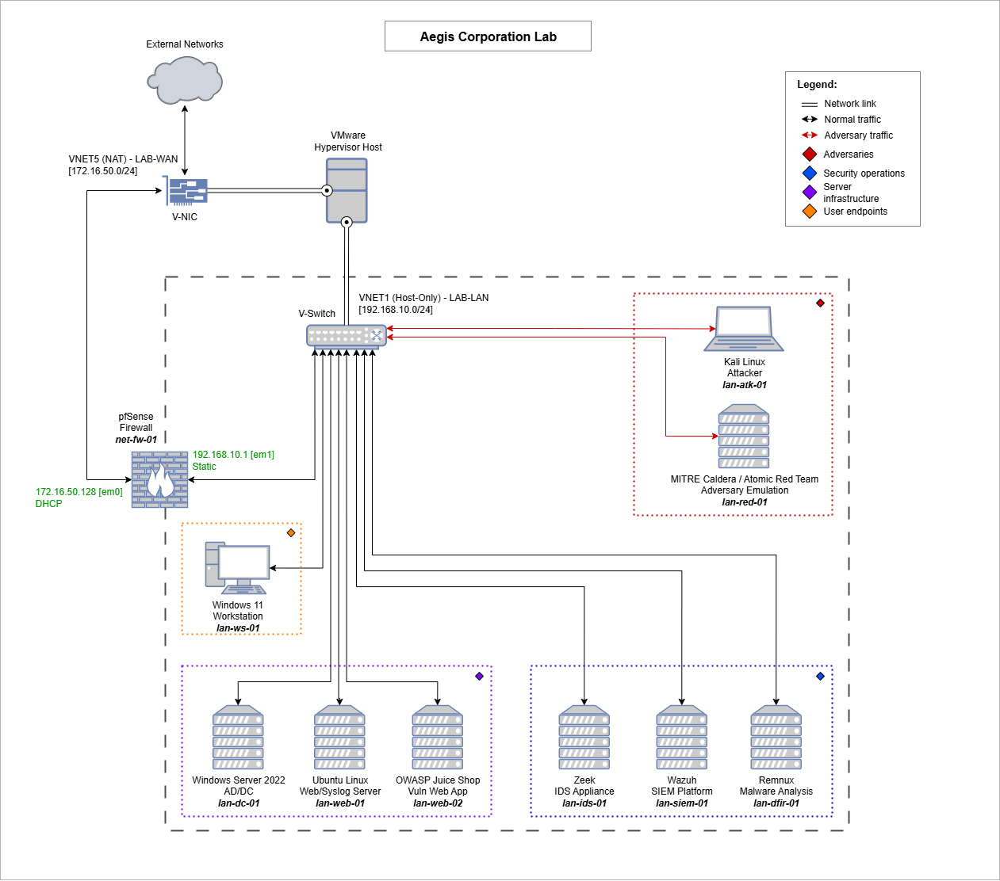

# 🛡️ Aegis Corporation Lab

The Aegis Corporation Lab is a virtualised environment designed to simulate a simple network infrastructure with integrated security monitoring, threat simulation, and analysis capabilities. The aim is to provide an isolated and controlled environment for hands-on exposure to the tools and techniques associated with security operations and adversary tradecraft.

## 🏗️ Architecture

### Network Segments
- **WAN Network (VNET5)**: `172.16.50.0/24` - External-facing network (WAN)
- **LAN Network (VNET1)**: `192.168.10.0/24` - Internal network (LAN)

### Core Components

| Component                  | Hostname    | Purpose                                        |
| -------------------------- | ----------- | ---------------------------------------------- |
| **pfSense Firewall**       | net-fw-01   | Network security gateway                       |
| **Wazuh SIEM**             | lan-siem-01 | Security monitoring & alerting                 |
| **Zeek**                   | lan-ids-01  | Intrusion detection                            |
| **Kali Linux**             | lan-atk-01  | Penetration testing & attack simulation        |
| **REMnux**                 | lan-dfir-01 | Malware analysis & forensics                   |
| **MITRE Caldera**          | lan-red-01  | Adversary emulation platform                   |
| **Windows AD/DC**          | lan-dc-01   | Domain services & target environment           |
| **Windows 11 Workstation** | lan-ws-01   | GPO and Security policies & target environment |
| **Linux Server 22.04**     | lan-web-01  | Syslog and web server & target environment     |
| **OWASP Juice Shop**       | lan-web-02  | Vulnerable web application                     |

## 📖 Documentation

- [pfSense Setup](docs/pfsense/pfsense-setup-guide.md)
- [pfSense Configuration](docs/pfsense/pfsense-configuration.md)

## 🔗 Resources

- [MITRE ATT&CK Framework](https://attack.mitre.org/)
- [OWASP Testing Guide](https://owasp.org/www-project-web-security-testing-guide/)
- [Wazuh Documentation](https://documentation.wazuh.com/)
- [pfSense Documentation](https://docs.netgate.com/pfsense/en/latest/)

## ⚠️ Disclaimer

This lab is for educational and authorized testing purposes only. All malware samples, attack tools, and techniques should only be used in controlled environments and/or with explicit permission.

## 📄 License

This project is licensed under the MIT License - see the [LICENSE](LICENSE) file for details.
