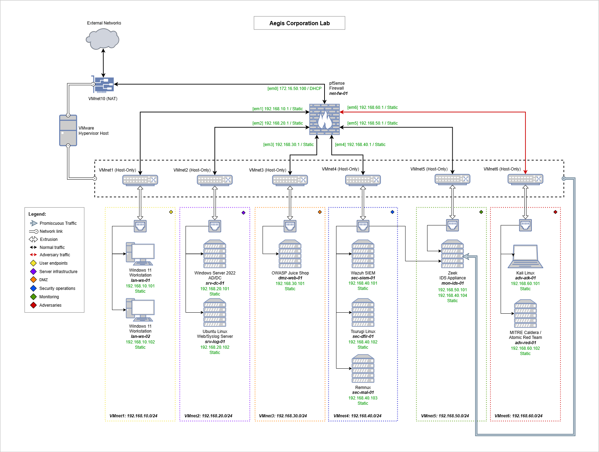

# 🛡️ Aegis Corporation Lab

The Aegis Corporation Lab is a virtualised environment designed to simulate a simple network infrastructure with integrated security monitoring, threat simulation, and analysis capabilities. The aim is to provide an isolated and controlled environment for hands-on exposure to the tools and techniques associated with security operations and adversary tradecraft.

## 🏗️ Architecture

### Network Segments
- **VNET10**: `172.16.50.0/24` - External networks/Gateway (WAN)
- **VNET1**: `192.168.10.0/24` - User devices (LAN)
- **VNET2**: `192.168.20.0/24` - Server infrastructure (LAN)
- **VNET3**: `192.168.30.0/24` - External-facing services (DMZ)
- **VNET4**: `192.168.40.0/24` - Security operations (LAN)
- **VNET5**: `192.168.50.0/24` - Monitoring network (LAN)
- **VNET6**: `192.168.60.0/24` - Adversarial network (LAN)

### Core Components

| Component                  | Hostname    | Purpose                                        |
| -------------------------- | ----------- | ---------------------------------------------- |
| **pfSense Firewall**       | net-fw-01   | Network security gateway                       |
| **Windows 11 Workstation** | lan-ws-01   | GPO and Security policies & target environment |
| **Windows 11 Workstation** | lan-ws-02   | GPO and Security policies & hardening          |
| **Windows AD/DC**          | lan-dc-01   | Domain services & target environment           |
| **Linux Server 22.04**     | srv-web-01  | Syslog and web server & target environment     |
| **OWASP Juice Shop**       | dmz-web-02  | Vulnerable web application                     |
| **Wazuh SIEM**             | lan-siem-01 | Security monitoring & alerting                 |
| **Tsurugi Linux**          | lan-siem-01 | DFIR & Linux malware analysis                  |
| **REMnux**                 | lan-dfir-01 | Windows malware analysis                       |
| **Zeek**                   | mon-ids-01  | Intrusion detection and monitoring             |
| **Kali Linux**             | adv-atk-01  | Penetration testing & attack simulation        |
| **MITRE Caldera**          | adv-red-01  | Adversary emulation platform                   |

## 📖 Documentation

- [pfSense Setup](docs/pfsense/pfsense-setup.md)
- [pfSense Configuration](docs/pfsense/pfsense-configuration.md)

## 🔗 Resources

- [MITRE ATT&CK Framework](https://attack.mitre.org/)
- [OWASP Testing Guide](https://owasp.org/www-project-web-security-testing-guide/)
- [Wazuh Documentation](https://documentation.wazuh.com/)
- [pfSense Documentation](https://docs.netgate.com/pfsense/en/latest/)

## ⚠️ Disclaimer

This lab is for educational and authorized testing purposes only. All malware samples, attack tools, and techniques should only be used in controlled environments and/or with explicit permission.

## 📄 License

This project is licensed under the MIT License - see the [LICENSE](LICENSE) file for details.
